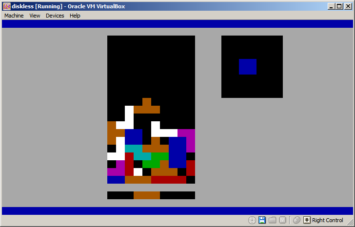

# µTris

A rudimentary tetris clone that fits into a 512b bootsector of x86 devices and works without an operating system

## Building

Make sure to have NASM installed. Then just run `make`


## Testing

To test in QEMU:

```
qemu-system-i386 -drive format=raw,file=disk.img
```

To try on real hardware:

```
dd if=disk.img of=<PENDRIVE OR FLOPPY>
```

## Controls ###

    move   - left/right/down
    rotate - up
    drop   - space bar

## Screenshot ###


