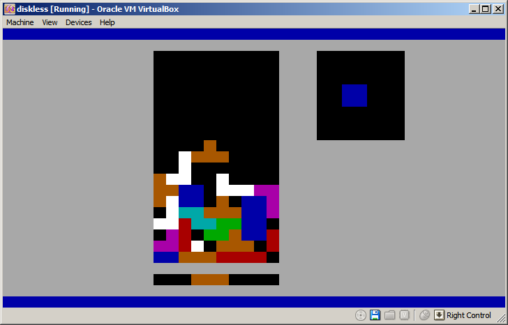
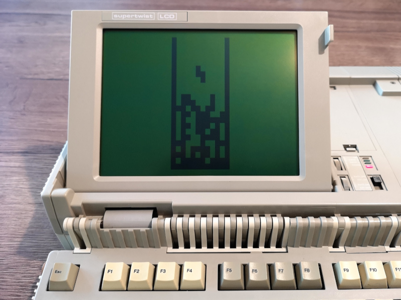

# µTris

A simple Tetris game that fits into a 512-byte bootsector of a PC.

It comes in two versions, a modern version for 586+ (Pentium and later) CPUs,
and a more basic one targetting vintage machines as old as 80186.

## Building

Make sure to have NASM installed. Then just run `make`

## Testing

To test in QEMU:

```
qemu-system-i386 -drive format=raw,file=disk-586.img
```

To try on real hardware:

```
dd if=disk-586.img of=<PENDRIVE OR FLOPPY>
```

## Controls ###

    move   - left/right/down
    rotate - up
    drop   - space bar

## Screenshots ###




